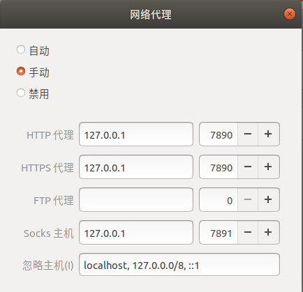

# Clash for Linux

## 应用概述
Clash是一款用Go语言开发，可以在Linux/MacOS/Windows等多平台使用的代理工具，配置也非常简单（特别是在Windows平台），支持ss/v*2ray（不支持ssr），支持规则分流（类似于 Surge 的配置）。

Clash项目为`GitHub`开源项目，可以[下载](https://github.com/Dreamacro/clash/releases)各平台的安装包：

## 应用下载与安装

下载当前操作系统与 CPU 架构对应的包文件，我这儿是 X86_64 平台下的，所以对应的使用`clash-linux-amd64-v1.1.0.gz`包即可。(实测`Ubuntu 18.04`/`Ubuntu 20.04`都没问题)

可以通过以下命令完成Clash安装工作。

```shell
# 下载clash压缩包
wget -O clash.gz https://github.com/Dreamacro/clash/releases/download/v1.10.0/clash-linux-amd64-v1.10.0.gz
# 解压缩到/usr/local/bin目录下; 赋予可执行权限; 删除压缩包文件
sudo gzip -dc clash.gz > /usr/local/bin/clash
sudo chmod +x /usr/local/bin/clash
rm -f clash.gz
```

## 应用配置

### 添加Clash配置文件

Clash的运行需要两个文件`Country.mmdb`和`config.yaml`。
其中`Country.mmdb`可以直接通过链接下载，`config.yaml`则存储着节点等配置，一般都是由机场等服务商提供。

**这两个文件缺一不可**

我个人习惯将这些配置文件存在`主目录`下的隐藏文件夹中。
```shell
# 创建文件夹
cd ~ && mkdir .clash && cd .clash
# 下载Country.mmdb
wget -O /etc/clash/Country.mmdb https://www.sub-speeder.com/client-download/Country.mmdb
```

### 设置启动脚本
创建 systemd 脚本，脚本文件路径为 /etc/systemd/system/clash.service。
```shell
cd /etc/systemd/system/
sudo gedit clash.service
```

在弹出的文件编辑器中粘贴以下内容，<kbd>Ctrl</kbd><kbd>S</kbd>保存后再关闭。

```service
[Unit]
Description=clash

[Service]
Type=simple
User=root
ExecStart=/usr/local/bin/clash -d /home/你的用户名/.clash/
Restart=on-failure

[Install]
WantedBy=multi-user.target
```

使用以下命令设置Clash自启动，并启动Clash

```shell
# 重载服务配置
sudo systemctl daemon-reload
# Clash服务自启动
sudo systemctl enable clash

# 启动Clash服务
sudo systemctl start clash
# 查看Clash状态
sudo systemctl status clash
```

### 设置本机网络代理
打开`设置->网络`，在网络代理一栏选择`手动`，并做出以下配置。



http代理、https代理: `127.0.0.1` `7890`

socks主机: `127.0.0.1` `7891`

至此所有配置就已经完成了，可以通过浏览器尝试访问[Youtube](https://www.youtube.com)检测是否设置成功。


## Clash可视化
在Clash设置成功后，直接访问以下链接即可查看当前机场的节点信息，可以实现简单的修改。

[Clash可视化](http://clash.razord.top/#/proxies)

