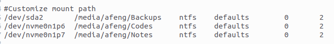
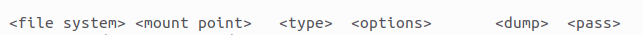

# 硬盘挂载处理
一般情况下Ubuntu的文件系统只会加载系统安装时所选择的磁盘分区。

对于安装了双系统的PC，其它分区自然不会主动加载。对于Ubuntu磁盘挂载这个问题在之前一直没有了解过，这一次尝试主要是因为`Ubuntu 22.04`安装以后，在`Dock`中主动显示了磁盘的其他分区(可以直接通过右键进行挂载)。


## 磁盘分区挂载
### 简单方式
正如上文所述，可以直接在`dock`中选中磁盘分区，使用右键进行挂载操作。
### 极客方式
```shell
# 主要命令
sudo mount /dev/sda2 /media/afeng/Backups
```

想要通过命令行实现磁盘挂载，首先必须要知道磁盘分区的卷标名，其次存在磁盘挂载点(就是一个目录)。

先通过[简单方式](#简单方式)将分区挂载，然后通过以下命令得知分卷信息。

```shell
df -a

# afeng@afeng:~$ df -a
# 文件系统           1K-块     已用      可用 已用% 挂载点

# ... 其他分区信息省略

# /dev/sda2      209715196 81966480 127748716   40% /media/afeng/Backups
# /dev/nvme0n1p6  10484732  4505876   5978856   43% /media/afeng/Codes
# /dev/nvme0n1p7  10485756    36620  10449136    1% /media/afeng/Notes
```
上述三个分区就是我此次想要完成挂载的目标，`/dev/sda2`,`/dev/nvme0n1p6`,`/dev/nvme0n1p7`就是它们的卷标，每次PC重启，这些分区卷标都不会改变(除非认为修改分区)。

通过以下命令完成目标磁盘分区的挂载，挂载点不存在可以手动创建
```shell
sudo mkdir /media/afeng/Backups
sudo mount /dev/sda2 /media/afeng/Backups
```
## 磁盘分区自动挂载
上述通过`mount`方式完成的挂载在每次PC重启时都会失效，在临时挂载时常用，如果想重启不失效可通过以下方法设置开机自动挂载。

添加磁盘挂载信息到相关的配置文件`/etc/fstab`中，完成后重启依然挂载有效。
```shell
sudo gedit /etc/fstab
```


### 说明



文件数据存在6个分段：
1. 指代文件系统的设备名。最初，该字段只包含待挂载分区的设备名（如/dev/sda1）。现在，除设备名外，还可以包含LABEL或UUID
2. 文件系统挂载点。文件系统包含挂载点下整个目录树结构里的所有数据，除非其中某个目录又挂载了另一个文件系统
3. 文件系统类型。下面是多数常见文件系统类型（ext3,tmpfs,devpts,sysfs,proc,swap,vfat）
4. mount命令选项。mount选项包括noauto（启动时不挂载该文件系统）和ro（只读方式挂载文件系统）等。在该字段里添加用户或属主选项，即可允许该用户挂载文件系统。多个选项之间必须用逗号隔开。其他选项的相关信息可参看mount命令手册页（-o选项处）
5. 转储文件系统？该字段只在用dump备份时才有意义。数字1表示该文件系统需要转储，0表示不需要转储
6. 文件系统检查？该字段里的数字表示文件系统是否需要用fsck检查。0表示不必检查该文件系统，数字1示意该文件系统需要先行检查（用于根文件系统）。数字2则表示完成根文件系统检查后，再检查该文件系统

其中分段3文件系统类型(type)在[磁盘挂载](#简单方式)后，使用`blkid`命令进行查看
```shell
sudo blkid /dev/sda2

# /dev/sda2: LABEL="Backups" BLOCK_SIZE="512" UUID="**********" TYPE="ntfs" PARTUUID="**************"
```
至此磁盘挂载操作就基本完成了。

## 特殊情况
在使用以上述自动挂载操作一段时间后，突然出现磁盘能挂载但是无法读取磁盘的情况，显示没有权限读取文件分区，同时显示该分区目前文件系统为只读。

翻找尝试了资料半天也没有解决办法，最后发现安装`ntfs-3g`后使用其相关指令后即可正常使用。(同时建议关闭`Windows`系统的快速启动)

同时只需要将`/etc/fstab`中挂载的文件类型`ntfs`改为`ntfs-3g`即可完成日常自动挂载。
## 参考链接
[博客园:Ubuntu挂载新硬盘](https://www.cnblogs.com/avril/archive/2010/03/23/1692783.html)


