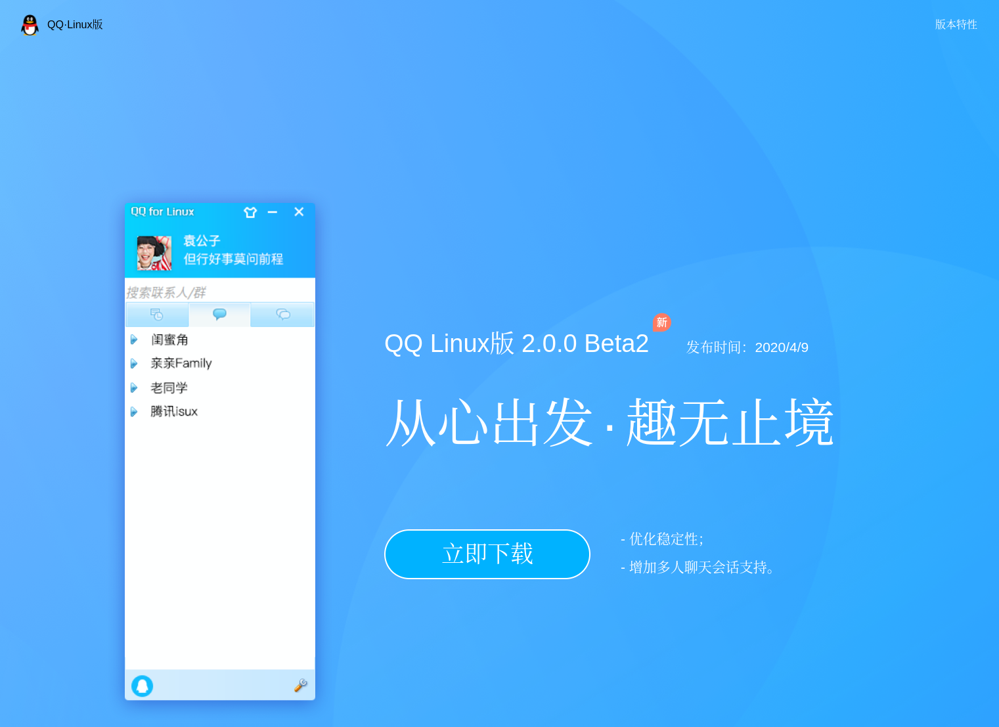
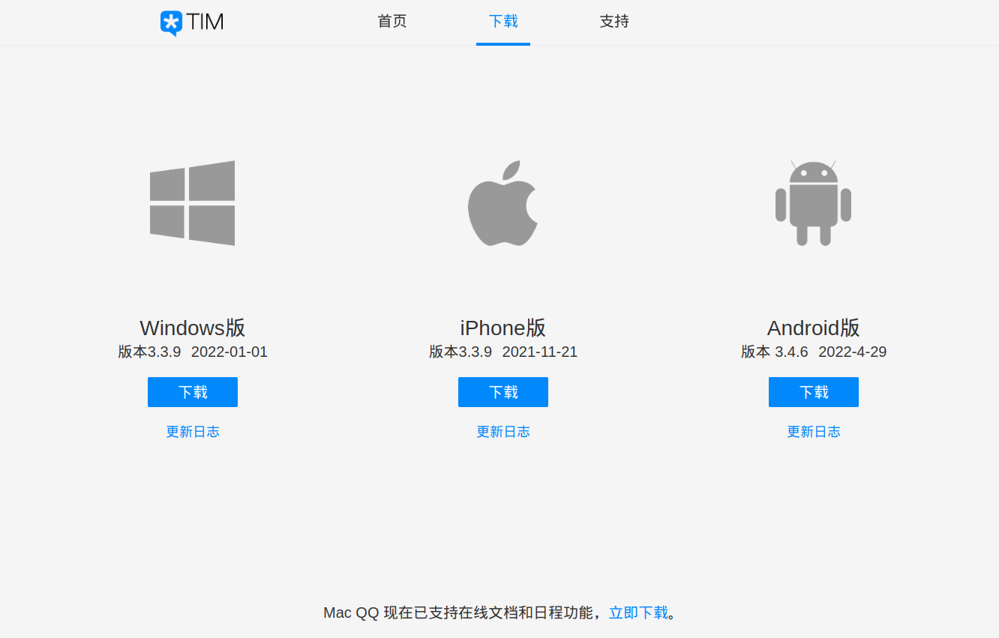
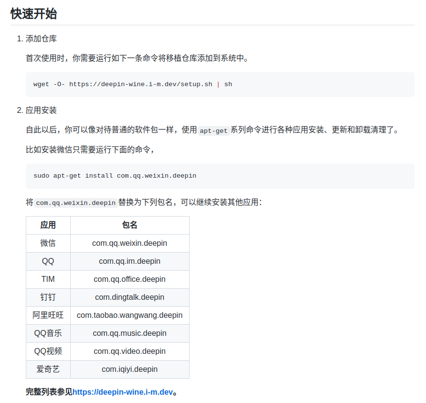
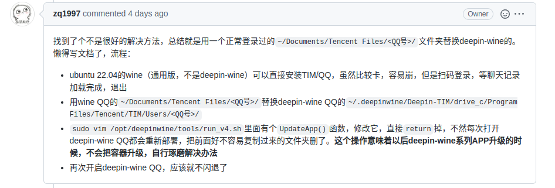
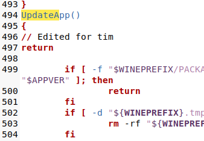

# Ubuntu安装QQ/TIM

[视频讲解](https://www.bilibili.com/video/BV1GL4y1K7Ye)
## 查看官网
### QQ官网
可以在官网找到[Linux版本](https://im.qq.com/linuxqq/index.html)


该版本可以正常使用，不过UI和功能欠佳，没办法满足我的需求，所以QQ官方版放弃。

### TIM官网
经查询，TIM官方并未发布`Linux`版本安装包，TIM官方版同样放弃。


## 通过星火商店
一个Ubuntu上的AppStore——[星火商店](https://www.spark-app.store/)，安装完毕以后，直接打开软件搜索安装即可，是一个国产的用爱维护的社区商店。  
在这个商店里可以选择官方版QQ，虽然安装依然基于`wine`系列，但是经过精心维护，不需要自己动手做复杂配置，体验也优于前者，同时安全性由于第三方QQ。

## 开源项目Icalingua++
进入项目[Release页面](https://github.com/Icalingua-plus-plus/Icalingua-plus-plus/releases)下载对应.deb包，通过`sudo dpkg -i`安装即可。  
适配和体验都优于下面所讲的`wine`系列，但由于非官方出品，所以随时有停止维护等可能。

## 开源项目deepin-wine
得知在`GitHub`中有两个项目`wine`和`deepin-wine`可以完成上述的安装，在之前尝试安装微信时使用的是`wine`，但是依照文档安装后发现有些问题，相对比下使用`deepin-wine`可以直接安装，索性这次也同样选择`deepin-wine`。

### 安装
依照开源项目[deepin-wine](https://github.com/zq1997/deepin-wine)的文档，添加仓库链接，安装`TIM`/`QQ`即可完成安装。
```shell
# 添加仓库链接
wget -O- https://deepin-wine.i-m.dev/setup.sh | sh
# 安装TIM
sudo apt-get install com.qq.office.deepin
```


### 配置修改
安装完成后，并不能直接成功运行程序，`TIM`/`QQ`会无响应或者崩溃，在我看来是由于加载文件相对较多导致的。

按照`deepin-wine`项目中`issues`给出的方案可以解决。


1. 不同的是，我并安装`wine`安装并运行`TIM`/`QQ`，而是直接将`Windows`系统下对应的文件`C:/Users/<用户名>/Documents/Tencent Files/<QQ号>/`替换到了`~/.deepinwine/Deepin-TIM/drive_c/Program Files/Tencent/TIM/Users/<QQ号>/`中
2. 修改`/opt/deepinwine/tools/run_v4.sh`文件中的`UpdateApp()`函数，使其直接`return`。


## 参考链接
[官网:星火商店](https://www.spark-app.store/)  
[GitHub开源项目:Icalingua++](https://github.com/Icalingua-plus-plus/Icalingua-plus-plus)
[GitHub:开源项目deepin-wine](https://github.com/zq1997/deepin-wine)  
[GitHub:issues解决方案](https://github.com/zq1997/deepin-wine/issues/269)
