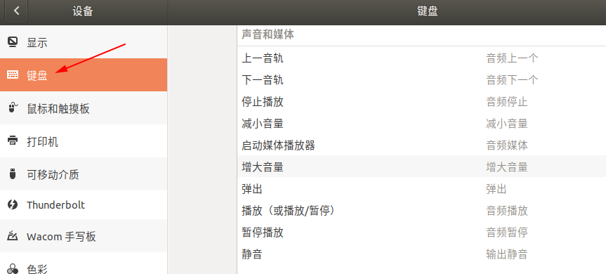
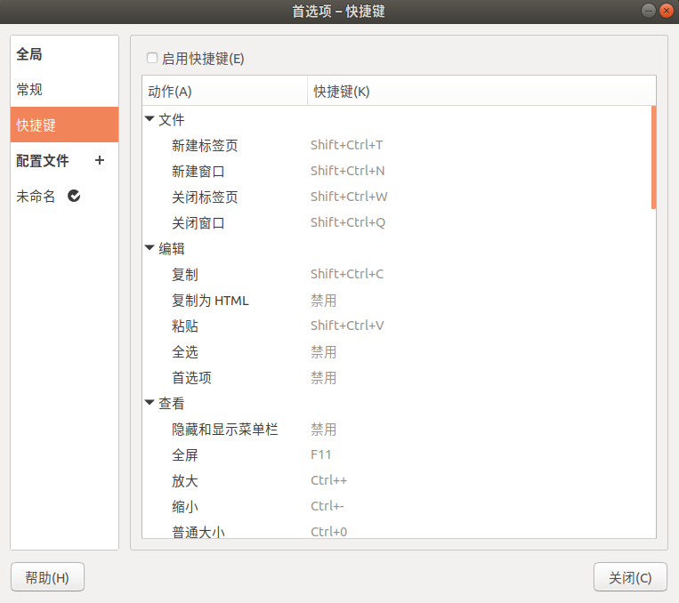

# Ubuntu常用快捷键&自定义按键绑定

作为一个从`Windows`系统过来的人，在这里说明以下：`Ubuntu`中的<kbd>Super</kbd>键实际和`Windows`中的<kbd>Win</kbd>键是同一个键。

`Ubuntu`系统默认快捷键可以直接在`设置->设备->键盘`中查看。

## 常用快捷键
|  |  |
| - | - |
| <kbd>PrtSc</kbd> | 截屏 |
| <kbd>Ctrl</kbd><kbd>Shift</kbd><kbd>Alt</kbd><kbd>R</kbd> | 录屏 |
||
| <kbd>Ctrl</kbd><kbd>Alt</kbd><kbd>T</kbd> | 打开终端 |
| <kbd>Ctrl</kbd><kbd>Alt</kbd><kbd>Del</kbd> | 注销用户 |
||
| <kbd>Super</kbd><kbd>A</kbd> | 显示所有应用程序 |
| <kbd>Super</kbd><kbd>L</kbd> | 锁定屏幕 |
| <kbd>Super</kbd><kbd>D</kbd> | 显示桌面 |
| <kbd>Super</kbd><kbd>Tab</kbd> | 应用程序切换 |
||
| <kbd>Alt</kbd><kbd>F2</kbd> | 运行一个命令 |
| <kbd>Alt</kbd><kbd>Tab</kbd> | 应用程序切换 |
| <kbd>Alt</kbd><kbd>Esc</kbd> | 应用窗口切换 |

## 自定义按键绑定
多多少少受到了`Windows`系统及程序的影响，所以根据使用习惯做了一些自定义按键绑定。

|  |  |
| - | - |
| <kbd>Super</kbd><kbd>I</kbd> | 打开设置 |
| <kbd>Super</kbd><kbd>E</kbd> | 打开主目录(文件管理器) |
| <kbd>Super</kbd><kbd>G</kbd> | 打开浏览器 |
| <kbd>Super</kbd><kbd>R</kbd> | 打开终端 |
||
| <kbd>Alt</kbd><kbd>A</kbd> | 截图 |
| <kbd>Alt</kbd><kbd>↑</kbd> | 音量+ |
| <kbd>Alt</kbd><kbd>↓</kbd> | 音量- |
| <kbd>Alt</kbd><kbd>←</kbd> | 上一曲 |
| <kbd>Alt</kbd><kbd>→</kbd> | 下一曲 |

## 终端中常用快捷键

在终端中的快捷键，可以打开终端后在`编辑->首选项->快捷键`中查看启用。

|  |  |
| - | - |
| <kbd>Ctrl</kbd><kbd>D</kbd> | 结束终端 |
| <kbd>Ctrl</kbd><kbd>W</kbd> | 删除前一内容段 |
||
| <kbd>Ctrl</kbd><kbd>Shift</kbd><kbd>T</kbd> | 新建终端标签页 |
| <kbd>Ctrl</kbd><kbd>Shift</kbd><kbd>N</kbd> | 新建终端窗口 |
| <kbd>Ctrl</kbd><kbd>Shift</kbd><kbd>C</kbd> | 复制 |
| <kbd>Ctrl</kbd><kbd>Shift</kbd><kbd>V</kbd> | 粘贴 |
| <kbd>Ctrl</kbd><kbd>Shift</kbd><kbd>F</kbd> | 查找 |

