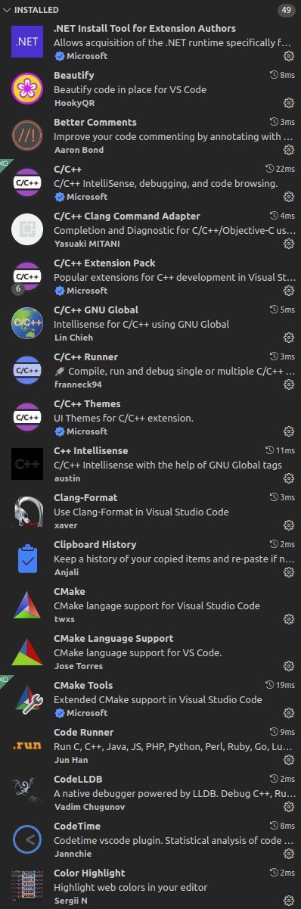
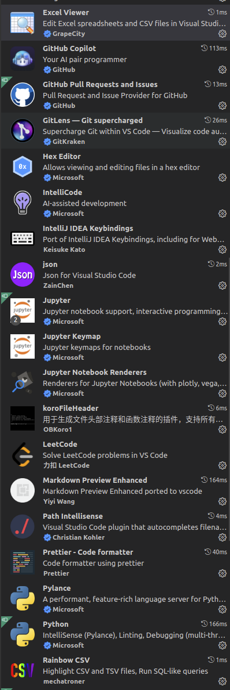
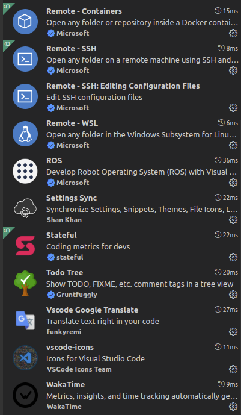

# Visual Studio Code常用插件
个人常用的VSCode插件，插件并不是越多越好！插件本质上是为了提高生产效率，但一味的纠结搜罗插件实属本末倒置。

## 实用工具
`Clipboard History` 记录剪切板历史  
`vscode-icons` 图标美化  
`Excel Viewer` 表格数据格式化  
`json` 格式化json+整理  
`Rainbow CSV` csv数据美化  
`Todo Tree` 自定义注释代码高亮+整理  
`LeetCode` 力扣刷题  
`Path Intellisense` 路径补全  
`Settings Sync` 设置同步  
`CodeTime` 代码时间记录  
`WakaTime` 代码时间记录  
`Color Highlight` 颜色代码高亮  
`GitLens` Git历史可视化  
`Markdown Preview Enhanced` 全面的Markdown解析  

## 代码工具
`CMake`  
`CMake Tools`  
`Code Runner` 代码快速运行插件  
`IntelliCode` 代码补全  
`GitHub Copilot` 代码补全  
`ROS`  

  
  
  

